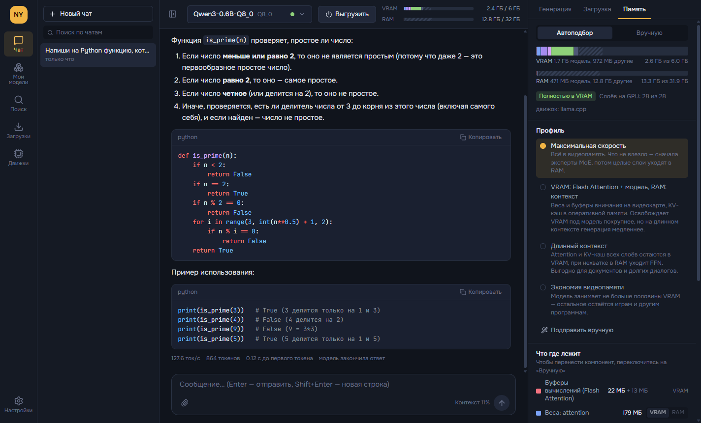
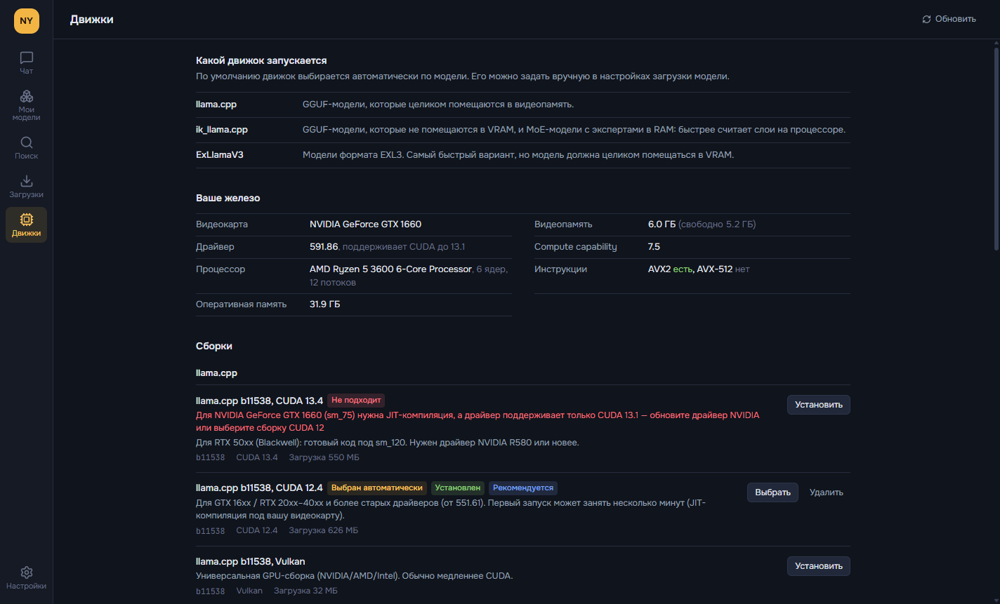

# NeuroYouStudio

Локальный запуск языковых моделей на своей видеокарте — в духе LM Studio, но с упором на то,
**что именно лежит в видеопамяти, а что в оперативной**.

- Несколько движков, выбор автоматический:
  - **llama.cpp** — модели GGUF, которые целиком помещаются в VRAM;
  - **ik_llama.cpp** — когда модель не влезает и часть уходит в RAM (особенно MoE);
  - **ExLlamaV3** (через TabbyAPI) — модели EXL3, быстрый разбор длинных промптов и лучшее качество на бит.
- **Карта памяти VRAM/RAM** по компонентам: буферы Flash Attention, веса attention и FFN, эксперты MoE,
  выходной слой, контекст (KV-кэш), vision-проектор. Автоподбор по профилю или ручная раскладка,
  после загрузки — сравнение плана с фактом из логов движка.
- Все настройки загрузки и генерации из LM Studio: длина контекста, квантование KV-кэша, RoPE, mmap/mlock,
  спекулятивное декодирование, Top K/P, Min P, штрафы, XTC, Mirostat, JSON-схема, GBNF, рассуждения, пресеты.
- Чат с историей, версиями ответов, ветками, продолжением ответа, markdown, подсветкой кода и формулами.
- Вложения: картинки для vision-моделей; PDF, DOCX и текстовые файлы. Документ, который помещается в контекст,
  вставляется целиком, иначе — наиболее подходящие фрагменты.
- Поиск и скачивание моделей с Hugging Face с докачкой и оценкой «влезет ли в вашу видеокарту».





## Установка

Скачайте `NeuroYouStudio-Setup-<версия>.exe` (установщик) или `NeuroYouStudio-Portable-<версия>.exe`
со страницы [Releases](https://github.com/MatyanKass/NeuroYouStudio/releases).

При первом запуске откройте раздел «Движки» и установите рекомендованный движок — приложение само
подберёт сборку под вашу видеокарту и драйвер (для RTX 50xx — CUDA 13, для более старых — CUDA 12).
Затем найдите модель в разделе «Поиск», скачайте её и загрузите в чате.

Требования: Windows 10/11 x64. Для ускорения на GPU — видеокарта NVIDIA со свежим драйвером.

## Где что лежит

| Что | Папка |
|---|---|
| Настройки, чаты, пресеты | `%APPDATA%\NeuroYouStudio` |
| Движки, логи | `%LOCALAPPDATA%\NeuroYouStudio` |
| Модели (можно сменить в настройках) | `%USERPROFILE%\NeuroYouStudio\models` |

## Разработка

```bash
npm install
npm run dev      # запуск с горячей перезагрузкой
npm run check    # типы, линтер, тесты
npm run dist     # установщик и portable EXE в release/
```

Стек: Electron, React, TypeScript, Tailwind CSS, Vitest.
